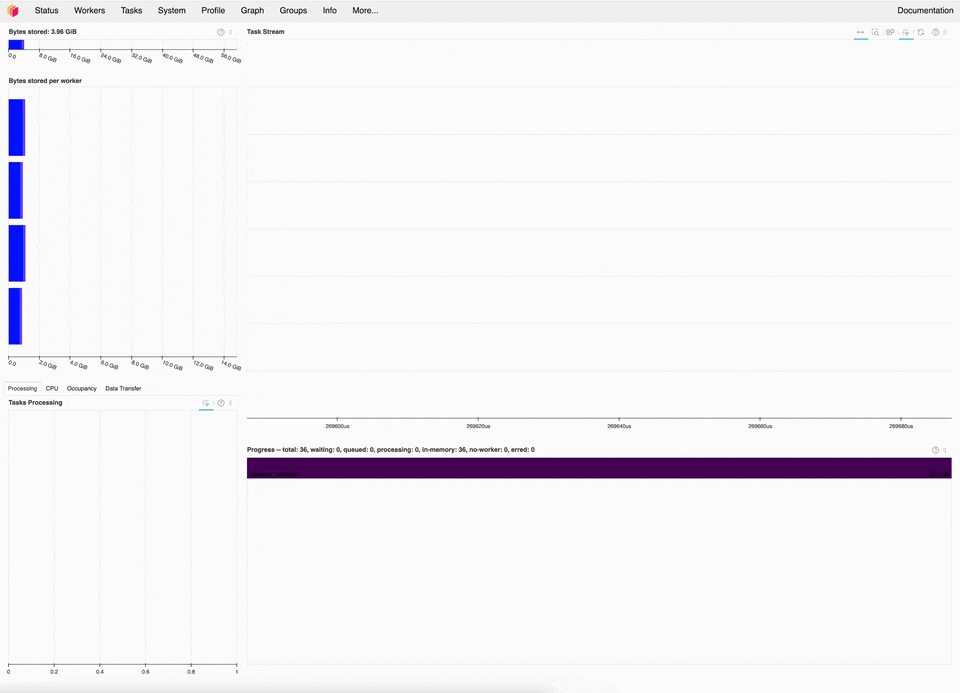

_There have been a number of engineering [improvements to Dask Array](https://docs.dask.org/en/stable/changelog.html#v2024-11-2) like consistent chunksizes in Xarray rolling-constructs and improved efficiency in `map_overlap`. Notably, as of Dask version 2024.11.2, calculating quantiles is much faster and more reliable._



## Calculating Quantiles with Xarray

Calculating quantiles is a common operation for geospatial data. Quantiles show how a dataset is distributed over time, allowing you to identify trends, anomalies, and variation within specific grid cells or regions. These calculations are typically performed either for distinct groups within the dataset or across the dataset as a whole.

## The Problem: `np.quantile` Can Be Slow

The data we often encounter typically has a relatively short time axis, consisting of only a few hundred to a few thousand values, while the latitude and longitude dimensions are extensive.

Previously, the quantile calculation for every coordinate was done on a pretty small array with the NumPy implementation `np.quantile` or `np.nanquantile`:

```python
import numpy as np

np.quantile(np.random.randn(500), q=0.5)
```

Dask lacked an efficient efficient multidimensional implementation for calculating quantiles, which meant calling the one-dimensional NumPy implementation millions of times in Python. This is very slow and also blocks the GIL (looking forward to a free-threaded Python world 😅). This caused large slowdowns on workers with more than one thread and could lead to runtimes over 200s per chunk.

Running the following computation previously took over 3 minutes to complete:

```python
import xarray as xr
import dask.array as da

arr = da.random.random((50, 3_000, 3_000), chunks=(-1, "auto", "auto"))

darr = xr.DataArray(
    arr, dims=["time", "x", "y"]
)

darr.quantile(dim="time", q=0.75).compute()
```

<script src="https://fast.wistia.com/player.js" async></script><script src="https://fast.wistia.com/embed/9erk2qeo5l.js" async type="module"></script><style>wistia-player[media-id='9erk2qeo5l']:not(:defined) { background: center / contain no-repeat url('https://fast.wistia.com/embed/medias/9erk2qeo5l/swatch'); display: block; filter: blur(5px); padding-top:72.08%; }</style> <wistia-player media-id="9erk2qeo5l" seo="false"></wistia-player>

_Computing quantiles used to be painfully slow. The computation takes ~3 minutes to complete._

## The Solution: A New `dask.array.quantile`

As of `dask=2024.11.2`, we've added a high-level quantile API to Dask that uses top level NumPy functions to extract the quantile for each time slice. The operations are more expensive than an optimal quantile implementation, but the vectorized, multidimensional nature of each call makes it a lot faster in aggregate. And we don't block the GIL anymore, so you can run with proper parallelism on your Dask workers.

<script src="https://fast.wistia.com/player.js" async></script><script src="https://fast.wistia.com/embed/lq8sj9yaf1.js" async type="module"></script><style>wistia-player[media-id='lq8sj9yaf1']:not(:defined) { background: center / contain no-repeat url('https://fast.wistia.com/embed/medias/lq8sj9yaf1/swatch'); display: block; filter: blur(5px); padding-top:72.08%; }</style> <wistia-player media-id="lq8sj9yaf1" seo="false"></wistia-player>

_Using the new implementation, this same microbenchmark takes ~9 seconds, a 20x speedup._

The new quantile implementation reduces runtime to ~1s per chunk, independent of the number of threads. This means we're able to calculate quantiles hundreds of times faster than before! You can expect the speedups to scale with the size of your quantile axis.
