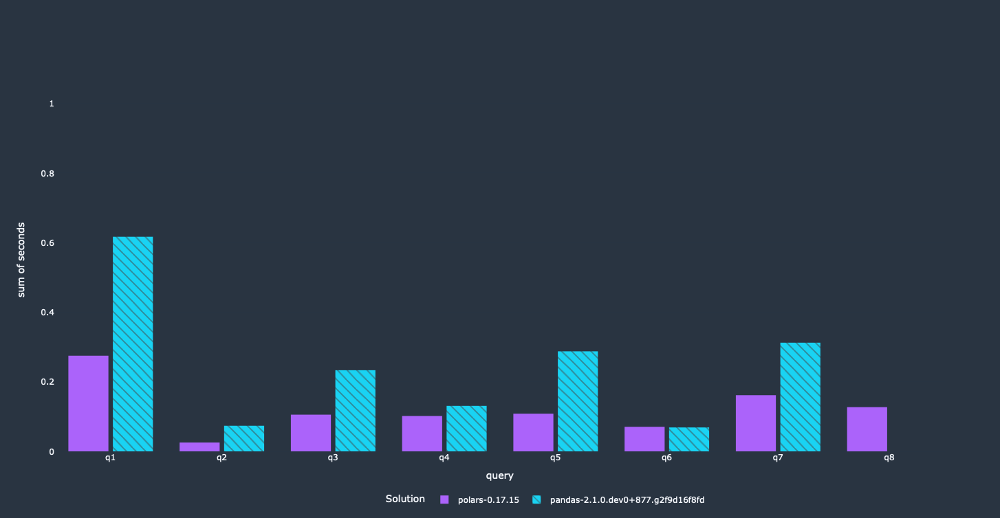

_Or: How writing efficient pandas code matters_


## Introduction
I've regularly seen benchmarks that show how much faster Polars is compared to pandas. 
The fact that Polars is faster than pandas is not too surprising since it is multithreaded while 
pandas is mostly single-core. The big difference surprises me though. That's why I decided to take 
a look at the pandas queries that were used for the benchmarks. 

I was curious to find out whether there was room for improvement. This post will detail a couple 
of easy steps that I took to speed up pandas code. The pandas performance improvements are quite 
impressive!

We will look at the ``tpch`` benchmarks from
the [Polars repository](https://github.com/pola-rs/tpch) with ``scale_1`` including I/O time. 

Fair warning: I had to try this a couple of times since the API changed. You can switch to version 
0.17.15, if you encounter problems, that's what I used. Additionally, I am using the current 
development version of pandas because some optimizations for Copy-on-Write and the 
Pyarrow ``dtype_backend`` were added after 2.0 was released. The development version was also used 
to create the baseline plots, so all performance gains shown in here can be attributed to the 
refactoring steps. You can use this version starting from August at the latest!

I came away with one main takeaway:

- Writing efficient pandas code __matters a lot__.

I have a MacBook Air with M2 processors and 24GB of RAM. The benchmarks are only run once in 
default mode. I repeated the calculations 15 times and used the mean as result.

## Baseline

I ran the benchmarks "as is" as a first step to get the status-quo.


It's relatively easy to see that Polars is between 4–10 times faster than pandas. After getting 
these results I decided to look at the queries that were used for pandas. A couple of relatively 
straightforward optimizations will speed up our pandas code a lot. Additionally, we will get other
benefits out of it as well, like a significantly reduced memory footprint.

Side note: Number 8 is broken, so no result there.

## Initial refactoring

One thing that stood out is that the whole parquet files were read even though most queries only 
needed a small subset. Some queries also did some operations on the whole dataset and dropped the 
columns later on. A filtering operation is slowed down quite a bit when performed on the full 
DataFrame compared to only a fraction of the columns, e.g.:

```python
new_df = df[mask]
new_df = df[["a", "b"]]
```

This is significantly slower than restricting the DataFrame to the relevant subset beforehand:

```python
df = df[["a", "b"]]
new_df = df[mask]
```

There is no need to read these columns at all, if they are not used somewhere within your code. 
Pushing the column selection into ``read_parquet`` is easy, since this is offered by PyArrow through 
the ``columns`` keyword.

```python
df = pd.read_parquet(...)
df = df[df.a > 100]
df[["a", "b"]]
```

This is rewritten into:

```python
df = pd.read_parquet(..., columns=["a", "b"])
df = df[df.a > 100]
```

I've also turned Copy-on-Write on. It's now in a state that it shouldn't have many performance 
problems while it will most likely give a speedup. That said, the difference here is not too big, 
since the benchmarks are ``GroupBy`` and ``merge`` heavy, which aren't really influenced by CoW. 
This was a quick refactoring effort that took me around 30 minutes for all queries. Most queries 
restricted the DataFrame later on anyway, so it was mostly a copy-paste exercise.

Let's look at the results:


The pandas queries got a lot faster through a couple of small modifications, e.g. we can see 
performance improvements by a factor of 2 and more. Since this avoids loading unnecessary columns 
completely, we reduced the memory footprint of our program significantly.

## Further optimizations - leveraging Arrow

A quick profiling showed that the filter operations were still a bottleneck for a couple of queries. 
Fortunately, there is an easy fix. ``read_parquet`` passes potential keywords through to PyArrow and 
Arrow offers the option to filter the table while reading the parquet file. Moving these filters up 
gives a nice additional improvement.

```python
df = pd.read_parquet(..., columns=["a", "b"])
df = df[df.a > 100]
```

We can easily pass the filter condition to Arrow to avoid materializing unnecessary rows:
```python
import pyarrow.compute as pc


df = pd.read_parquet(..., columns=["a", "b"], filters=pc.field("a") > 100)
```

Arrow supports an Expression style for these filter conditions. You can use more or less all 
filtering operations that would be available in pandas as well. Let's look at what this means 
performance-wise.



We got a nice performance improvement for most queries. Obviously, this depends on what filter was 
used in the query itself. Similar to the first optimization, this will reduce the memory footprint 
significantly, since rows violating the filter won't be loaded into memory at all.

There is one relatively straightforward optimization left without rewriting the queries completely.

## Improving ``merge`` performance

The following trick requires knowledge about your data and can’t be applied in a general way. This 
is more of a general idea that isn’t really compliant with tpch rules, but nice to see nevertheless.

This technique is a bit tricky. I stumbled upon this a couple of years ago when I had a performance
issue at my previous job. In these scenarios, ``merge`` is basically used as a filter that restricts
one of both DataFrames quite heavily. This is relatively slow when using merge, because pandas
isn't aware that you want to use the ``merge`` operation as a filter. We can apply a filter
with isin before performing the actual merge to speed up our queries.

```python
import pandas as pd

left = pd.DataFrame({"left_a": [1, 2, 3], "left_b": [4, 5, 6]})
right = pd.DataFrame({"right_a": [1], "right_c": [4]})

left = left[left["left_a"].isin(right["right_a"])]  # restrict the df beforehand
result = left.merge(right, left_on="left_a", right_on="right_a")
```

This wasn't necessary for all queries, since only a couple of them were using ``merge`` in this way. 
The queries where we applied the technique got another nice performance boost!


We achieved our main objective here. Most of these queries run a lot faster now than they did 
before, and use less memory as well. The first query did not get that big of a speedup. It 
calculates a lot of results on a groupby aggregation, which is done sequentially. We are looking
into it right now how we can improve performance here.


## Summary

All in all these optimizations took me around 1.5-2 hours. Your mileage might vary, but I don't 
think that it will take you much longer, since most of the optimizations are very straightforward. 
A relatively small time investment where most
of the time was spent on reorganizing the initial queries. You can find the PR that modifies the 
benchmarks [here](https://github.com/pola-rs/tpch/pull/56). Polars has a query optimization layer, so it does some of
these things automatically, but this is not a guarantee that you'll end up with efficient code. 

We saw that writing more efficient pandas code isn't that hard and can give you a huge performance 
improvement. Looking at these queries helped us as well, since we were able to identify a couple of 
performance bottleneck where we are working on a solution. We were even able to make one of the 
queries run faster than the Polars version!

These performance improvements mostly translate to the ``scale_10`` version of the benchmarks.

Thanks for reading. Please reach out with any comments or feedback. I wrote a more general post about
[improving performance in pandas with PyArrow](https://towardsdatascience.com/utilizing-pyarrow-to-improve-pandas-and-dask-workflows-2891d3d96d2b) 
as well.
