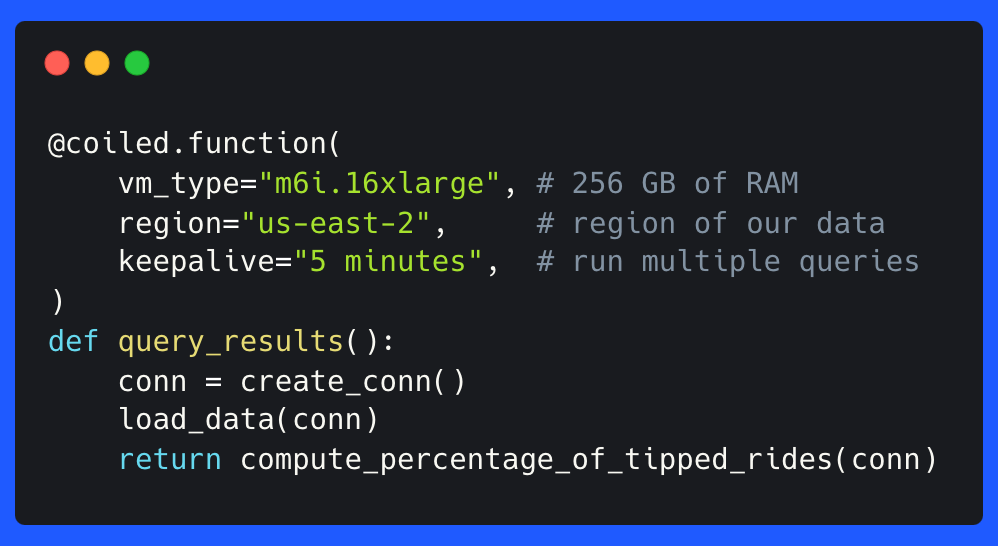
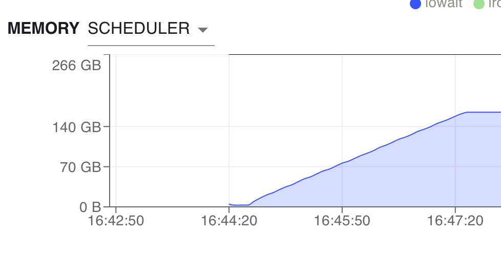

We recently pushed out two new and experimental features [Coiled Jobs](https://docs.coiled.io/user_guide/labs/jobs.html)
and [Coiled Functions](https://docs.coiled.io/user_guide/labs/run.html)
for easily running scripts and functions in the cloud.

In this post we'll use Coiled Functions to process the 150 GB [Uber-Lyft dataset](https://www.nyc.gov/site/tlc/about/tlc-trip-record-data.page) 
on a single machine with [DuckDB](https://duckdb.org).

## Getting started

We start with creating the SQL queries that we want to run against the data locally. 

```python
def load_data(conn):
  # Load data into memory so that subsequent queries are fast
  conn.execute(
    '''
    CREATE TABLE test AS 
    SELECT * FROM read_parquet("s3://coiled-datasets/uber-lyft-tlc/*")
    '''
  )


def compute_percentage_of_tipped_rides(conn):
    # Run the actual query
   return conn.execute(
       '''
       SELECT hvfhs_license_num, sum(tipped) / count(tipped)
        FROM (select 
           *,  
           CASE WHEN tips > 0.0 then 1 ELSE 0 end as tipped
           from test) GROUP BY hvfhs_license_num
       '''
   ).fetchall()


def create_conn():
    import duckdb

    return duckdb.connect()


def query_results():
    conn = create_conn()
    load_data(conn)
    return compute_percentage_of_tipped_rides(conn)

```

These queries aren't particularly fancy, they are meant to illustrate how we can process these
files. If we execute these queries as is, it would pull all the data onto our machine. The whole
dataset won't fit into memory on most workstations, so let's look at how Coiled can make this work. The loading
would take a long time, even if we had enough memory.

## Using ``coiled functions`` to run queries on a large VM

[Coiled Functions](https://docs.coiled.io/user_guide/labs/run.html) come into the equation since we 
need access to machines that have enough resources and are also close to our data. 
Coiled can connect to AWS or GCP and thus, use all resources that are available there.
We will go through the necessary steps execute these queries on a VM in the same region as our data
with enough memory available.

We'll have to adapt our ``create_conn`` function to set 
[the environment variables needed by DuckDB](https://duckdb.org/docs/guides/import/s3_import.html).

```python
def create_conn():
    import duckdb
    
    conn = duckdb.connect()
    conn.execute("INSTALL httpfs")
    conn.execute("LOAD httpfs")
    conn.execute(f"SET s3_region='us-east-2'")
    conn.execute(f"SET s3_access_key_id='{os.environ['AWS_ACCESS_KEY_ID']}'")
    conn.execute(f"SET s3_secret_access_key='{os.environ['AWS_SECRET_ACCESS_KEY']}'")
    return conn
```

There will be [an extension for DuckDB](https://github.com/duckdblabs/duckdb_aws) that can take 
care of this automatically starting from DuckDB 0.9.0.

The next step is adding the ``@coiled.function`` decorator to the function that executes our queries.
The decorator will tell Coiled that it should spin up a large VM on AWS and run the query there, and then return the result locally.

```python
@coiled.function(
    vm_type="m6i.16xlarge", # 256 GB of RAM
    region="us-east-2",     # region of our data
    keepalive="5 minutes",  # keep alive to run multiple queries if necessary
)
def query_results():
    conn = create_conn()
    load_data(conn)
    return compute_percentage_of_tipped_rides(conn)
```

Let's execute our queries and pull the results back to our local machine:

```python
result = query_results()

print(result)
[
  ('HV0005', 0.1912300216459857), 
  ('HV0003', 0.1498555901186066), 
  ('HV0004', 0.09294857737045926), 
  ('HV0002', 0.08440046492889111),
]
```

The data are now all in memory on our VM in the cloud:



There is no need to adjust the other functions. Coiled will run our query on a VM in the cloud with
enough resources and close to our data.

Let's take a brief look at the arguments to ``coiled.function()``:

- ``vm_type``: This specifies the type of [EC2 instance](https://aws.amazon.com/ec2/instance-types/).
  We are looking for an instance that has enough memory to hold our data. This instance has 256GB,
  so this should be sufficient.
- ``region``: The region specifies the AWS region that our VM is started in. Our data are also in
  ``"us-east-2"``.
- ``keepalive``: Keeps the VM alive so that we can run multiple queries against the data in memory.

``coiled.function()`` will now start a VM in AWS with the specified EC2 instance. The VM is normally up
and running in 1-2 minutes. Coiled will scan our local environment and replicate the same 
dependencies on this machine. We don't have to specify an explicit Python environment. Inputs of 
your function are serialized and sent to the VM
as well. Coiled will return our results back to our local machine.

Coiled would normally shut down the VM immediately after the Python interpreter finishes. This is mostly to
reduce costs. We specified
``keepalive="5 minutes"`` to keep the VM alive for a few of minutes after our Python interpreter
finished. This ensures that new local runs can connect to the same VM avoiding
the boot time of up to 2 minutes; we call this a warm start.

## Conclusion

``coiled functions`` enables you to run queries on a machine with as much memory as you want.
This grants you access to computational resources that can be very close to your data. Doing
data processing in the cloud becomes very easy with this functionality.

You can check out the [docs](https://docs.coiled.io/user_guide/labs/functions.html) 
or take a look at how to utilize Coiled Functions to train
a [neural network on a powerful GPU](https://medium.com/coiled-hq/how-to-train-a-neural-network-on-a-gpu-in-the-cloud-with-coiled-functions-40fa9aca723b).
