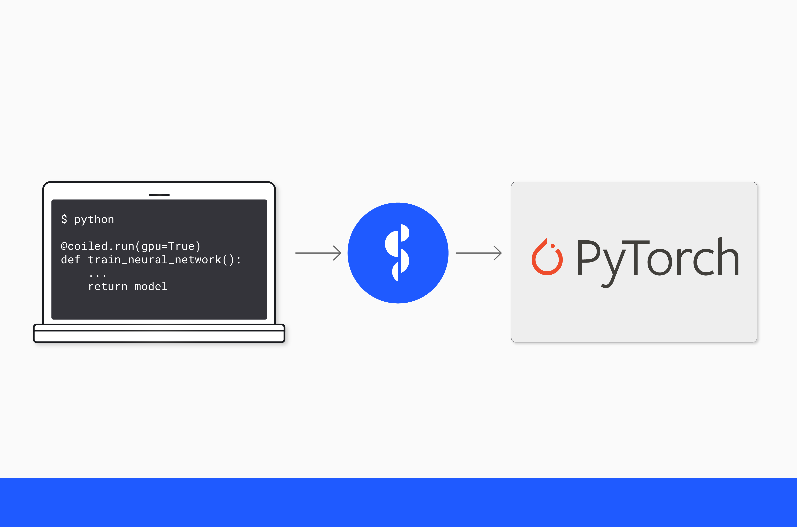

We recently pushed out two new and experimental features [coiled jobs](https://docs.coiled.io/user_guide/labs/jobs.html?utm_source=phofl&utm_medium=coiled-functions-gpu)
and [coiled functions](https://docs.coiled.io/user_guide/labs/run.html?utm_source=phofl&utm_medium=coiled-functions-gpu)
which is a deviation of ``coiled jobs``. We are excited about both of them because they:

- Allow users to scale up any given program on any hardware in the cloud.
- Make GPUs easily accessible without going through the pains of setting up environments in the cloud.

This post will provide an example how to utilize ``coiled functions`` to seamlessly train a 
__neural network__ on a GPU that is hosted in the cloud.

## Getting started

We have to start with creating a model on our local machine before we can start worrying about
training it. This blog post is not dedicated to figuring out a fancy mode, we will utilize the
``Net`` model that is given in the [PyTorch tutorials](https://pytorch.org/tutorials/beginner/introyt/introyt1_tutorial.html#training-your-pytorch-model).

We can simply add the model definition to our python script. There is no need to do anything
different. Similarly, we will use the transformer that is given there as well.

The next step is creating a function that we can use to train the model:

```python
def train(transform):
    device = torch.device("cpu")
    net = Net()
    net = net.to(device)

    trainset = torchvision.datasets.CIFAR10(
        root='./data', train=True, download=True, transform=transform,
    )
    trainloader = torch.utils.data.DataLoader(
        trainset, batch_size=4, shuffle=True, num_workers=2,
    )
    criterion = nn.CrossEntropyLoss()
    optimizer = optim.SGD(net.parameters(), lr=0.001, momentum=0.9)

    for i, data in enumerate(trainloader, 0):
        inputs, labels = data[0].to(device), data[1].to(device)

        optimizer.zero_grad()

        outputs = net(inputs)
        loss = criterion(outputs, labels)
        loss.backward()
        optimizer.step()

    return net
```

We can now train our model:

```python
if __name__ == "__main__":
    train()
```

This will train our model on the CPU of our local machine. The training is reasonably quick for such
a small model, but training time will grow exponentially as our model gets larger or if we are
using a significantly bigger dataset. Training the model on the CPU won't be sufficient anymore.
Additionally, there are a lot of machines out there that don't have GPUs built into them. For example, I'm using a MacBook Pro with an M2 CPU, which means my machine doesn't support ``cuda``.
Consequently, we need a different solution to make these steps accessible for folks who don't have
access to a local GPU.

## Using ``coiled functions`` to train the model on a cloud-hosted GPU

[Coiled functions](https://docs.coiled.io/user_guide/labs/run.html?utm_source=phofl&utm_medium=coiled-functions-gpu) come into the equation if you 
need access to resources that aren't available
locally. Coiled can connect to AWS or GCP and thus, use all resources that are available there.
We will go through the necessary steps to train our model on a GPU that is hosted on AWS instead
of our local CPU. 

The first step includes defining a Python environment to run our computations. We simply include
PyTorch, CUDA, and Coiled, that's it. Generally, you should use the same Python version that is
installed locally.

```python
import coiled

coiled.create_software_environment(
    name="pytorch",
    conda={
        "channels": ["pytorch", "nvidia", "conda-forge", "defaults"],
        "dependencies": [
            "python=3.11",
            "coiled",
            "pytorch",
            "torchvision",
            "torchaudio",
            "cudatoolkit",
            "pynvml",
        ],
    },
    gpu_enabled=True,
)
```

Coiled will create a Python environment for you. This step is only necessary when running your 
script for the first time. The resulting environment is cached which makes further runs more
efficient.

The next step is adding the ``@coiled.run`` decorator to our training
function that tells our program we want to execute said function on a machine in the cloud.

```python
@coiled.run(
    worker_vm_type="g5.xlarge", # GPU instance type
    region="us-west-2",
    software="pytorch",
)
```

Additionally, we have to tell PyTorch that we want to train the model on the GPU.

```python
def train():
    import torch
    # tell PyTorch to use the GPU
    device = torch.device("cuda:0")
    ...
    return net.to(torch.device("cpu"))
```

Putting this all together:

```python
@coiled.run(
    worker_vm_type="g5.xlarge",
    region="us-west-2",
    software="pytorch",
)
def train(transform):
    import torch
    device = torch.device("cuda:0")

    net = Net()
    net = net.to(device)

    trainset = torchvision.datasets.CIFAR10(
        root='./data', train=True, download=True, transform=transform,
    )
    trainloader = torch.utils.data.DataLoader(
        trainset, batch_size=4, shuffle=True, num_workers=2,
    )
    criterion = nn.CrossEntropyLoss()
    optimizer = optim.SGD(net.parameters(), lr=0.001, momentum=0.9)

    for i, data in enumerate(trainloader, 0):
        inputs, labels = data[0].to(device), data[1].to(device)

        optimizer.zero_grad()

        outputs = net(inputs)
        loss = criterion(outputs, labels)
        loss.backward()
        optimizer.step()

    return net.to(torch.device("cpu"))


if __name__ == "__main__":
    train()
```

Let's take a brief look at the arguments to ``coiled.run()``:

- ``worker_vm_type``: This specifies the type of [EC2 instance](https://aws.amazon.com/ec2/instance-types/).
  We are looking for an instance that has a GPU attached to it. The G5 family has Nvidia GPUs
  attached to it. The smallest version is sufficient for our example, but you can choose instances
  with up to 8 GPUs.
- ``region``: The region specifies the AWS region that our VM is started in. We observed that ``"us-west-2"``
  is a region where GPUs are easier to get. 
- ``software``: This specifies the coiled software environment that is installed. This corresponds
  to the environment that we previously created.

``coiled.run()`` will now start a VM in AWS with the specified EC2 instance. The VM is normally up
and running in 1-2 minutes. The previously specified Python environment is installed automatically.
Coiled executes the function on said VM. Inputs of your function are serialized and sent to the VM
as well. It makes sense to download the training data on the VM to reduce time that is spent sending
data to AWS. The function returns our model back to our local machine so that we can use it locally
without depending on AWS.

Coiled will shut down the VM immediately after the Python interpreter finishes. This is mostly to
reduce costs. You can specify a certain amount of time that the VM is kept alive through 
``keepalive="5 minutes"``. This ensures that new local runs can connect to the same VM avoiding
the boot time of up to 2 minutes; we call this a warm start.

## Conclusion

``coiled functions`` enables you to seamlessly port the training process for a neural network
from your local machine to AWS or GCP. This grants everyone access to multiple GPUs or huge
machines independent of the local machine that is actually used. Training a neural network on a
GPU becomes as easy as adding a decorator to the training function.
