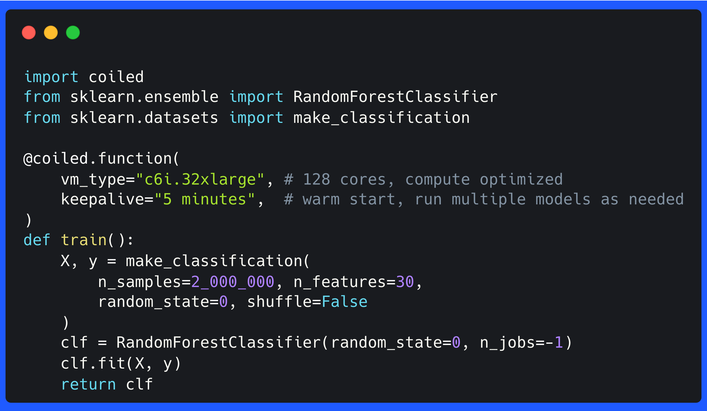
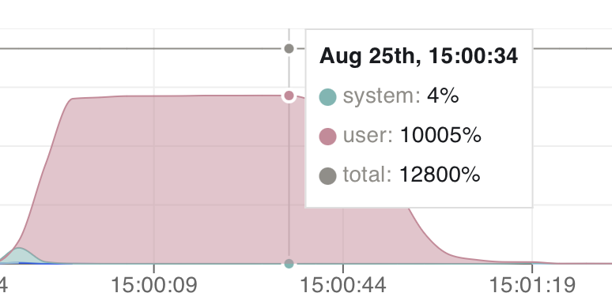

You can use [Coiled Run](https://docs.coiled.io/user_guide/labs/run.html)
and [Coiled Functions](https://docs.coiled.io/user_guide/labs/functions.html)
for easily running scripts and functions on a VM in the cloud.

In this post we'll use Coiled Functions to train a RandomForestClassifer on a cloud-hosted
machine that has enough cores to speed up our training process. The model parallelizes very well,
which means that training time on my local machine is only bound by the number of cores available.
Offloading this step onto a machine with 128 cores will save a lot of time during the training
process.

## Getting started

We will use random generated data for the purpose of this blog post. We will first train the model
locally, before we use Coiled Funtions to offload the calculation to AWS.

```python
from sklearn.ensemble import RandomForestClassifier
from sklearn.datasets import make_classification

def train():
    X, y = make_classification(n_samples=2_000_000, n_features=30, random_state=0, shuffle=False)
    clf = RandomForestClassifier(random_state=0, n_jobs=-1)
    clf.fit(X, y)
    return clf

```

We use 2 million samples and 30 features. This model takes around 12 minutes on my MacBook Air with
8 cores. The runtime can grow increasingly large if our dataset increases in size. We can speed up
that process through using a more powerful VM.

## Using ``coiled functions`` to train the model on a large VM

[Coiled Functions](https://docs.coiled.io/user_guide/labs/run.html) come into the equation since we need access to a machine with a lot of cores. 
Coiled can connect to AWS or GCP and thus, use all resources that are available there.
Let's train the same model as above, but this time on an EC2 instance with 128 cores.

Adding a ``@coiled.function`` decorator to the function that executes our training step is the only
modification we have to do. The decorator will tell Coiled that it should spin up a large VM on 
AWS and train the model there, and then return the trained model to our local machine.

```python
import coiled
from sklearn.ensemble import RandomForestClassifier
from sklearn.datasets import make_classification

@coiled.function(
    vm_type="c6i.32xlarge", # 128 cores, compute optimized
    keepalive="5 minutes",  # keep alive to train more models if necessary
)
def train():
    X, y = make_classification(n_samples=2_000_000, n_features=30, random_state=0, shuffle=False)
    clf = RandomForestClassifier(random_state=0, n_jobs=-1)
    clf.fit(X, y)
    return clf
```

Let's execute the training step and return the model back to our local machine:

```python
result = train()

RandomForestClassifier(n_jobs=-1, random_state=0)
```

Let's take a look at the CPU utilization during the training step:



There is no need to adjust the other functions. Coiled will run our function on a VM in the cloud with
enough resources.

Let's take a brief look at the arguments to ``coiled.function()``:

- ``vm_type``: This specifies the type of [EC2 instance](https://aws.amazon.com/ec2/instance-types/).
  We are looking for an instance that as many cores as possible to speed up our training step.
- ``keepalive``: Keeps the VM alive so that we can run multiple queries against the data in memory.

``coiled.function()`` will now start a VM in AWS with the specified EC2 instance. The VM is normally up
and running in 1-2 minutes. Coiled will scan our local environment and replicate the same 
dependencies on this machine. We don't have to specify an explicit Python environment. Inputs of 
your function are serialized and sent to the VM
as well. Coiled will return our results back to our local machine.

Coiled would normally shut down the VM immediately after the Python interpreter finishes. This is mostly to
reduce costs. We specified
``keepalive="5 minutes"`` to keep the VM alive for a few minutes after our Python interpreter
finished. This ensures that new local runs can connect to the same VM avoiding
the boot time of up to 2 minutes; we call this a warm start.

## Conclusion

``coiled functions`` enables you to run queries on a machine with as many cores as you need.
This grants you access to computational resources that can be hard to replicate locally.

For more resources:
- Check out the [documentation](https://docs.coiled.io/user_guide/labs/functions.html)
- Use Coiled functions to train a [neural net on a powerful GPU](https://medium.com/coiled-hq/how-to-train-a-neural-network-on-a-gpu-in-the-cloud-with-coiled-functions-40fa9aca723b)
- Process [process hundreds of GBs of data with DuckDB](https://medium.com/coiled-hq/process-hundreds-of-gb-of-data-with-coiled-functions-and-duckdb-4b7df2f84d2f) using Coiled functions
