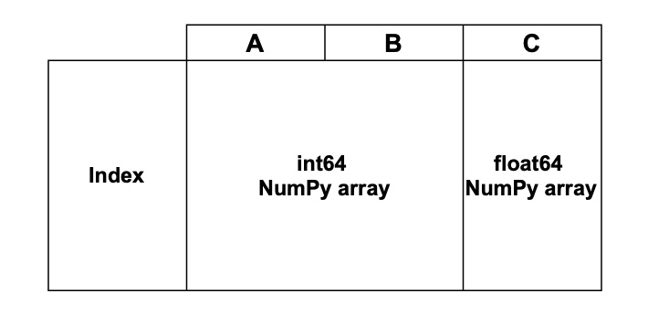

_How it works, how to adapt your code and how to use it effectively_

## Introduction

pandas 2.0 was released in early April and brought many improvements to the new Copy-on-Write (CoW)
mode. The feature is expected to become the default in pandas 3.0, which as of now is scheduled for
April 2024. There won't be a legacy or non-CoW mode.

This post will explain how Copy-on-Write works internally to help users understand what's going on
and afterward show how to use it effectively. This will include examples on how to leverage the
mechanism to get the most efficient performance and also show a couple of anti-patterns that will
result in unnecessary bottlenecks.

I am part of the pandas core team and was heavily involved in implementing and improving CoW so far. 
I've recently joined [Coiled](https://www.coiled.io) where I am working on Dask, including improving
the pandas integration and ensuring that Dask is compliant with CoW.

# How Copy-on-Write changes pandas behavior

Many of you are probably familiar with the following caveats in pandas:

```python
import pandas as pd

df = pd.DataFrame({"student_id": [1, 2, 3], "grade": ["A", "C", "D"]})
```

Let's select the grade-column and overwrite the first row with ``"E"``.

```python
grades = df["grade"]
grades.iloc[0] = "E"
df

   student_id grade
0           1     E
1           2     C
2           3     D
```

Unfortunately, this also updated ``df`` and not only ``grades``, which has the potential to 
introduce hard to find bugs. CoW will disallow this behavior and ensures that only ``df`` is
updated. We also see a false-positive ``SettingWithCopyWarning`` that doesn't help us here.

Let's look at a ``ChainedIndexing`` example that does nothing as well:

```python
df[df["student_id"] > 2]["grades"] = "F"
df

   student_id grade
0           1     A
1           2     C
2           3     D
```

We again get a ``SettingWithCopyWarning`` but nothing happens to ``df`` in this example. All these
gotchas come down to Copy and View rules in NumPy, which is what pandas uses under the hood. pandas
users have to be aware of these rules and how they apply to pandas DataFrames to understand why
similar code-patterns produce different results. 

CoW cleans up all these inconsistencies. Users can only update one object at a time when CoW is
enabled, e.g. ``df`` would be unchanged in our first example since only ``grades`` is updated at
that time and the second example raises a ``ChainedAssignmentError`` instead of doing nothing.
Generally, it won't be possible to update two objects at once, e.g., every object behaves as it
created a deep copy of the previous object.

There are many more of these cases, but going through all of them is not in scope here.

# How it works

We will now look into how Copy-on-Write works and highlight some details that are valuable to 
users. This is the main part of this post and is fairly technical.

Copy-on-Write promises that __any DataFrame or Series derived from another in__ 
__any way always behaves as a copy__. This means that it is not possible to modify more than one
object with a single operation, e.g. our first example above would only modify ``grades``. 

> Let's look at how a DataFrame is constructed. We assume that our DataFrame is backed by NumPy arrays,
> but the concept translates to DataFrames backed by PyArrow arrays. Every column of a DataFrame is
> backed by a NumPy array. One NumPy array with multiple columns can back multiple columns in a
> DataFrame. The arrays are wrapped by an object that is called ``Block``, but this is an 
> implementation detail and not relevant for CoW.
> 
> 
> 
> Our DataFrame has 3 columns, 2 of them have ``int64`` dtype and are stored in a single NumPy
> array while the third one has ``float64`` dtype and is a separate NumPy array. Columns that have the
> exact same dtype, e.g. can be stored in a NumPy array, are generally represented as a single array.
> 
> A pandas object is called a view, when an operation creates a new __pandas__ object that 
> references the same underlying NumPy arrays. Modifying said new object without CoW will generally
> also modify the previous object since the NumPy arrays are updated inplace.

We could guarantee the CoW promise through copying the underlying NumPy arrays in every operation,
which would avoid views in pandas altogether. This would guarantee CoW semantics but also incur a
huge performance penalty, so this wasn't an option for us. 

We will now dive into the mechanism that ensures that no two objects are updated with a single
operation __and__ that your data isn't unnecessarily copied.

We have to know exactly when to trigger a copy to achieve this objective. This means that we have
to keep track of whether one NumPy array is referenced by two DataFrames (generally, we have to be
aware if one NumPy array is referenced by two pandas objects, but I will use DataFrame for 
simplicity).

```python
df = pd.DataFrame({"student_id": [1, 2, 3], "grade": [1, 2, 3]})
df2 = df[:]
```

This statement creates a DataFrame ``df`` and a view of this DataFrame ``df2``. View means that
both DataFrames are backed by the same underlying NumPy array. When we look at this with CoW, 
``df`` has to be aware that ``df2`` also references the same NumPy array. This is not sufficient 
though. ``df2`` also has to be aware that ``df`` references its NumPy array. If both objects
are aware that there is another DataFrame references the same NumPy array, we can trigger a copy
in case one of them is modified, e.g.:

```python
df.iloc[0, 0] = 100
```

``df`` is modified inplace here. ``df`` knows that there is another object that references the same data, 
e.g. it triggers a copy. It is not aware which object references the same data, just that there is
another object that references its data.

Let's take a look at how we can achieve this. We created an internal class ``BlockValuesRefs`` that
is used to store this information. There are three different types of operation that create a 
DataFrame:

- A DataFrame is created from external data, e.g. through ``pd.DataFrame(...)`` or through any
  I/O method.
- A new DataFrame is created through a pandas operation that triggers a copy of the original data,
  e.g. ``dropna`` creates a copy in most cases.
- A new DataFrames is created through a pandas operation that __does not__ trigger a copy of the
  original data, e.g. ``df2 = df.reset_index()``.

The first two cases are simple. When the DataFrame is created, the NumPy arrays that back it are
connected to a fresh ``BlockValuesRefs`` object. This object creates a ``weakref`` that points
to the Block that wraps the NumPy array and stores this reference internally.

> A [weakref](https://docs.python.org/3/library/weakref.html) creates a reference to any Python
> object. It does not keep this object alive when it would normally go out of scope.
> ```python
> import weakref
> 
> class Dummy:
>     def __init__(self, a):
>         self.a = a
> 
> In[1]: obj = Dummy(1)
> In[2]: ref = weakref.ref(obj)
> In[3]: ref()
> Out[3]: <__main__.Dummy object at 0x108187d60>
> In[4]: obj = Dummy(2)
> ```
> 
> This example creates a Dummy object and a weak reference to this object. Afterward, we assign another
> object to the same variable, e.g. the initial object goes out of scope. The weak reference
> does not interfere with this process. If you resolve the weak reference, it will point to ``None``
> instead of the original object.
> 
> ```python
> In[5]: ref()
> Out[5]: None
> ```

This was the easy case. We know that no other pandas object shares the same NumPy array, so we can
simply instantiate a new reference tracking object. The third case is more complicated. Since the
new object views the same data as the original object, we have to account for this. These operations
will create a new ``Block`` that references the same NumPy array as the original pandas object.
Additionally, we take the original ``BlockValuesRefs`` object and add a weak reference to our new
``Block``.

TODO: image

Our ``BlockValuesRefs`` now points to the Block that backs the initial ``df`` and the newly created
DataFrame ``df2``. If one of these DataFrames is now modified, we can evaluate all weak references
that our reference tracking object stores. If one object is garbage collected, the reference will
evaluate to ``None``, which is a semi-automatic update of our references. If at least 2 of them 
evaluate to anything else than ``None``, we are aware that another DataFrame references the same 
data as we do. This enables us to trigger a copy when appropriate. 


# How to adapt your code

TODO

# How to get the most out of CoW

TODO
