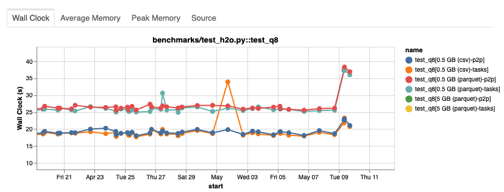
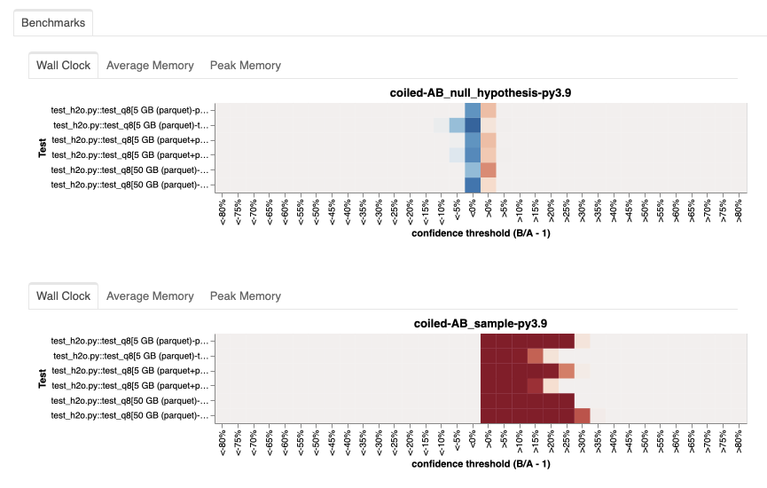
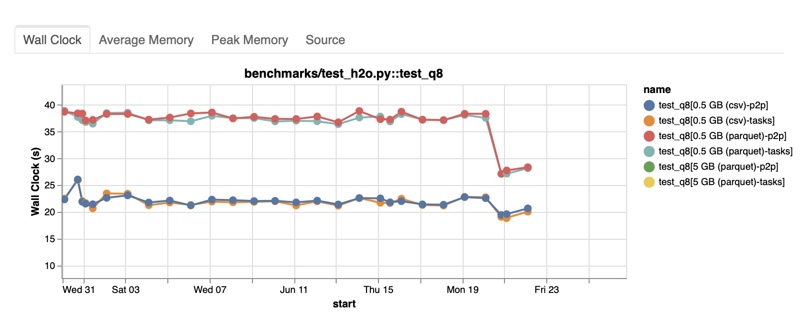

**Getting notified of a significant performance regression the day before release sucks, but quickly identifying and resolving it feels great!**

We were getting set up at our booth at JupyterCon 2023 when we received a notification:
An engineer on our team had spotted a significant performance regression in Dask.
With an impact of 40% increased runtime, it blocked the release planned for the next day!



Luckily, the other attendees still focused on coffee and breakfast, so we commandeered an abandoned table next to our booth and got to work.
## Performance testing at Coiled

The performance problem [had been flagged](https://github.com/coiled/benchmarks/issues/840) by the automated performance testing for Dask that we developed at [Coiled](https://www.coiled.io/?utm_source=phofl&utm_medium=dask-benchmark-pandas-bottleneck).
If you have not read Guido Imperiale's [blog post](https://blog.coiled.io/blog/performance-testing.html) on our approach to performance testing, here is a summary:
With [`coiled/benchmarks`](https://github.com/coiled/benchmarks), we created a benchmark suite that contains a variety of common workloads and operations with Dask, including standardized ones like the [`h2oai/db-benchmark`](https://github.com/h2oai/db-benchmark).

It also contains tooling that allows us to do two things:
* Automatically [detect performance regressions](https://blog.coiled.io/blog/performance-testing.html#nightly-tests) in Dask and raise them as issues.
* [Run A/B tests](https://blog.coiled.io/blog/performance-testing.html#a-b-tests) to assess the performance impact of different versions of Dask, upstream packages, or cluster configurations.

While the former started this journey, the latter will also come in handy soon.  
## Identifying the problem

Our automated regression testing had alerted us that [`test_h2o.py::test_q8`](https://github.com/coiled/benchmarks/blob/895a13db09eb3172155e7b1260a5698f2284f5b7/tests/benchmarks/test_h2o.py#L140-L151) had experienced [a significant increase](https://github.com/dask/community/issues/322#issuecomment-1542560550) in runtime across all data sizes and file formats. 
From the [historical report](https://benchmarks.coiled.io) of our benchmarking suite, we could see that `dask/dask` and `dask/distributed` were unlikely to be the culprit: 
Nothing had changed on `dask/dask` when the performance started to degrade, and there was only one unrelated change on `dask/distributed`. 
That left us with the Coiled platform and upstream packages as possible candidates. 

After digging deeper into the cluster data, we noticed that `pandas` had been upgraded from `1.5.3` to `2.0.1`. 
A major upgrade to `pandas` at the same time a dataframe-based workload shows degrading performance? That's suspicious! 

To confirm this suspicion, we ran an A/B test based on the current Dask release (`2023.4.1` at the time), testing the impact of the pandas upgrade. 
[The results](https://github.com/coiled/benchmarks/actions/runs/4946428740) were clear: The runtime increased significantly with `pandas=2.0.1` (sample).



Having shown that `pandas` caused for the performance degradation and that we could reproduce it with the current Dask release, our release process for `2023.5.0` [was cleared](https://github.com/dask/community/issues/322#issuecomment-1543878628).

To further analyze the problem, we also derived a [minimal local reproducer](https://matthewrocklin.com/minimal-bug-reports.html#minimal-complete-verifiable-examples) from the original workload:

```python
from dask.distributed import Client

client = Client()
uri = "s3://coiled-datasets/h2o-benchmark/N_1e7_K_1e2_parquet/*.parquet"
ddf = dd.read_parquet(uri, engine="pyarrow", storage_options={"anon": True}).persist()
wait(ddf)

ddf = ddf[["id6", "v1", "v2", "v3"]]
(
    ddf[~ddf["v3"].isna()][["id6", "v3"]]
    .groupby("id6", dropna=False, observed=True)
    .apply(
        lambda x: x.nlargest(2, columns="v3"),
        meta={"id6": "Int64", "v3": "float64"},
    )[["v3"]]
).compute()
```

## Investigating the pandas performance degradation

The only user-visible thing that changed between pandas 1.5.3 and pandas 2.0.1 was the default value
of ``group_keys`` in ``GroupBy``. Switching to ``group_keys=False`` with version 2.0.1
got us back to the initial runtime.
Now that we knew that pandas was to blame for the performance degradation, we had to create a 
reproducer in plain pandas to help fix the issue.

```python
df = pd.DataFrame(
    {
        "foo": np.random.randint(1, 50_000, (100_000, )), 
        "bar": np.random.randint(1, 100_000, (100_000, )),
    },
)

df.groupby(
    "foo", group_keys=False
).apply(lambda x: x.nlargest(2, columns="bar"))
```

- ``group_keys=False``: approx. 11 seconds
- ``group_keys=True``: approx. 15 seconds

Experimenting a bit showed us that the bottleneck got even worse while increasing the number of 
groups during the ``groupby`` calculation. We settled on this version which is 30% slower with 
``group_keys=True``, enough to be able to troubleshoot the problem. There was no obvious reason
why the changed value should bring a significant slowdown.

``%prun`` showed us that the time was almost exclusively spent in a post-processing step that
combines all groups via ``concat``.

## Addressing the performance degradation

Let's look at how both cases differ. The new version passes the grouping levels to ``concat``, which
are used to construct the resulting Index levels. This shouldn't be that slow though. Investigations
showed that this runs through a code-path that is very inefficient!

Looking closer at the results of ``%prun`` pointed us to one specific loop that took up most of
the runtime. This loop calculates the ``codes`` for the resulting index based on the provided 
levels. It's slow, really slow! Every single element provided as ``keys``, which 
represent the number of groups, is checked against the whole level, which explains our previous 
observation that the runtime got worse with an increasing number of groups. You can check out the 
[pandas user guide](https://pandas.pydata.org/pandas-docs/stable/user_guide/merging.html#more-concatenating-with-group-keys)
if you are interested in situations where this is useful. Fortunately, we have a convenient
advantage in case of ``groupby``. We know beforehand that every key equals the specific level. 
We added a fast-path that exploits this knowledge getting the runtime of this step more or less to
zero.

This change resulted in a [small PR](https://github.com/pandas-dev/pandas/pull/53195) that cut 
the runtime of ``group_keys=True`` to approximately 11 seconds as well.

## Conclusion

Now that we made our pandas reproducer run 30% faster, we have to check whether we accomplished our
initial objective. Re-running the local Dask reproducer should give us an idea about the
impact on Dask. We got the performance down to 22 seconds as well! Promising news that saved
our plans for the evening!

Unfortunately, we had to wait until pandas 2.0.2 was released to run a proper benchmark.



This looks great! Our small pandas change translated to our Dask query and got performance back
to the previous level!
