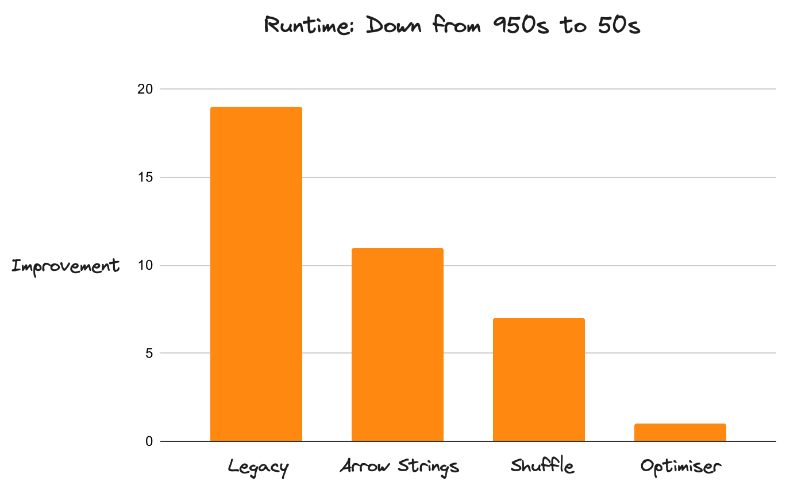
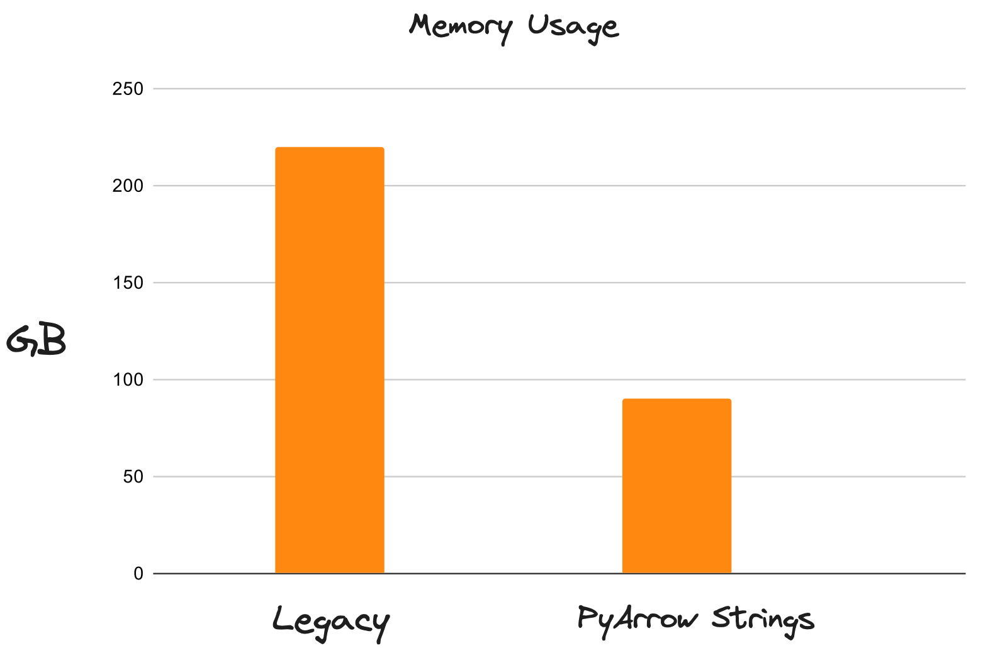
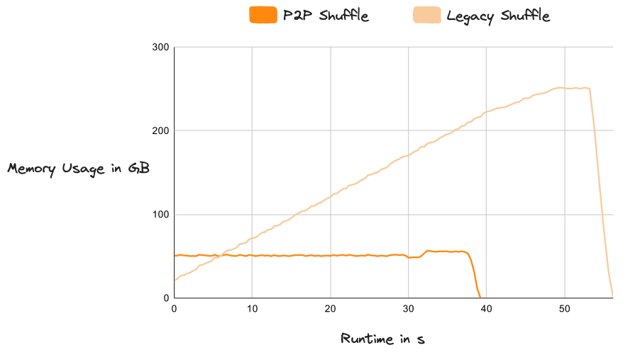
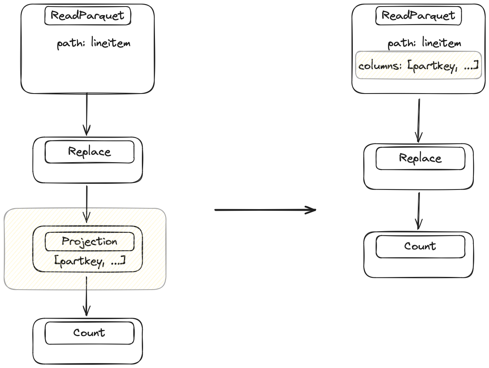
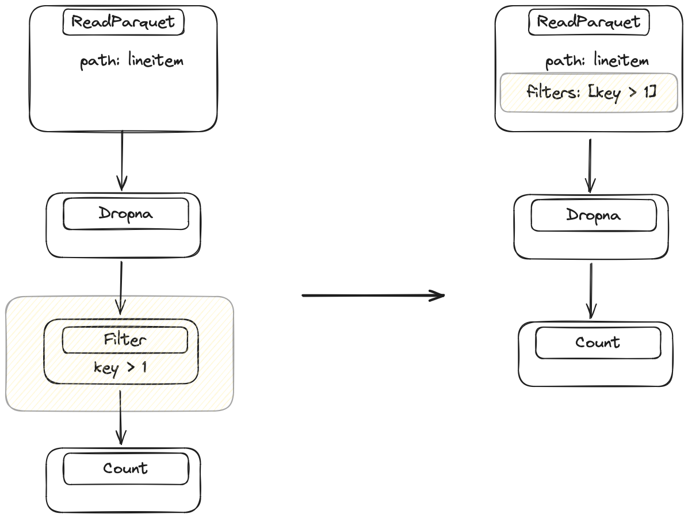
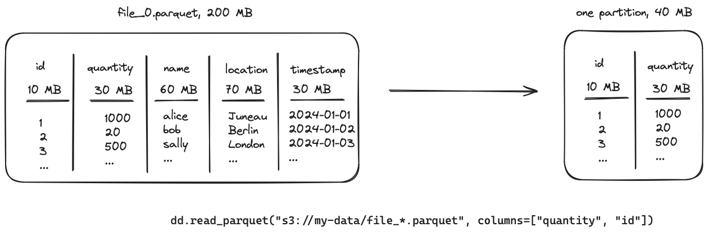
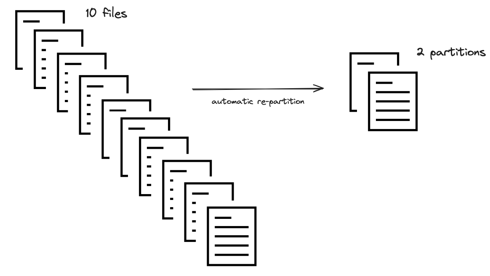
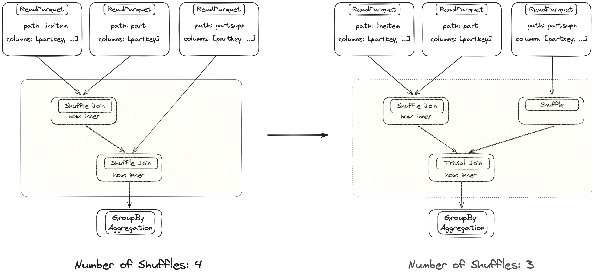
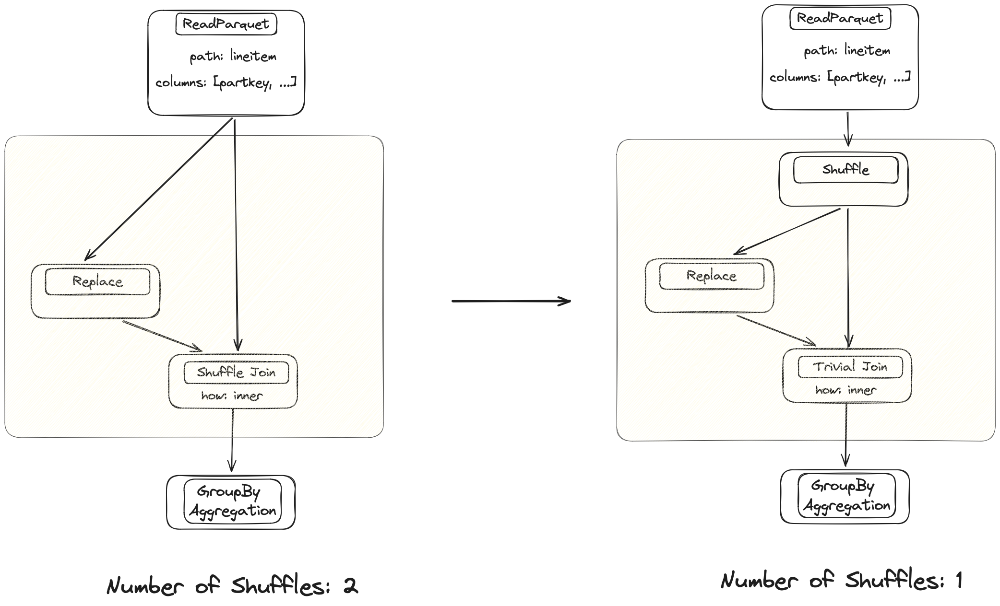

## Intro

Dask DataFrame scales out pandas DataFrames to operate at the 100GB-100TB scale.

Historically, [Dask](https://www.dask.org/) was pretty slow compared to other tools in this space (like Spark). Due to a number of improvements focused on performance,
it's now pretty fast (about 20x faster than before). The new implementation moved Dask from getting destroyed by
Spark on every benchmark to regularly outperforming Spark on TPC-H queries by a significant margin.

Dask DataFrame workloads struggled with many things. Performance and memory usage were
commonly seen pain points, shuffling was unstable for bigger datasets, making scaling out
hard. Writing efficient code required understanding too much of the internals of Dask.

The new implementation changed all of this. Things that didn't work were completely rewritten from scratch and existing
implementations were improved upon. This puts Dask DataFrames on a solid foundation that
allows faster iteration cycles in the future.

We'll go through the three most prominent changes:

1. Apache Arrow support
2. Faster joins
3. Query optimization

We'll cover how these changes impact performance and make it easier to use Dask efficiently, even for users that are new to distributed computing. We'll also discuss plans for future improvements.

## 1. Apache Arrow Support: Efficient String Datatype

A Dask DataFrame consists of many pandas DataFrames. Historically, pandas used NumPy for numeric data, 
but Python objects for text data, which are inefficient and blow up memory usage. Operations on 
object data also hold the GIL, which doesn't matter much for pandas, but is a catastrophy for 
performance with a parallel system like Dask.

The pandas 2.0 release introduced support for general-purpose Arrow datatypes, so [Dask now uses PyArrow-backed
strings by default](https://docs.coiled.io/blog/pyarrow-in-pandas-and-dask.html).  These are *much* better.  PyArrow strings reduce memory usage by up to 80% and
unlock multi-threading for string operations. Workloads that previously
struggled with available memory now fit comfortably in much less space, and are
a lot faster because they no longer constantly spill excess data to disk.

## 2. Faster Joins with a New Shuffle Algorithm

Shuffling is an essential component of distributed systems to enable sorting, joins, and complex group by operations. It is an all-to-all, network-intensive operation that's often the most expensive component in a workflow. Dask has a new shuffling system, which greatly impacts overall performance, especially on complex, data-intensive workloads.

A shuffle operation is intrinsically an all-to-all communication operation where every
input partition has to provide a tiny slice of data to every output partition. Dask was already
using it's own task-based algorithm that managed to reduce the ``O(n * n)``  task
complexity to ``O(log(n) * n)`` where ``n`` is the number of partitions. This was a drastic
reduction in the number of tasks, but the non-linear scaling ultimately did not allow Dask to process
arbitrarily large datasets.

Dask introduced a new [P2P (peer-to-peer) shuffle  method](https://docs.coiled.io/blog/shuffling-large-data-at-constant-memory.html) that reduced the task complexity to ``O(n)``
which scales linearly with the size of the dataset and the size of the cluster. It also
incorporates an efficient disk integration which allows easily shuffling datasets which are much
larger than memory.  The new system is extremely stable and "just works" across any scale of data.

## 3. Optimizer

Dask itself is lazy, which means that it registers your whole query before doing any actual work.
This is a powerful concept that enables a lot of optimizations, but historically Dask wasn't taking advantage of this
knowledge in the past. Dask also did a bad job of hiding internal complexities and
left users on their own while navigating the difficulties of distributed computing and running
large scale queries. It made writing efficient code painful for non-experts.

[The Dask release in March](https://docs.dask.org/en/stable/changelog.html#query-planning) includes a complete re-implementation of the DataFrame API to support query optimization. This is a big deal.
The new engine centers around a query optimizer that rewrites your code to make it more efficient and
better tailored to Dask's strengths. Let's dive into some optimization strategies, how they make
Dask run faster and scale better.

We will start with a couple general-purpose optimizations:

1. Column projection
2. Filter pushdown

And then dive into more specific techniques that are tailored to distributed systems generally
and Dask more specifically:

3. Automatic partition resizing
4. Trivial merge and join operations

(column-projection)=
### 3.1 Column Projection

Most datasets have more columns than needed. Dropping them requires foresight ("What columns will I need for this query? 🤔") so most people don't think about this when loading data. This is bad for performance because carrying around lots of excess data slows everything down.
Column Projection drops columns as soon as they aren't needed anymore. It's a straightforward optimization, but highly beneficial.

The legacy implementation always reads all columns from storage and only drops columns when explicitly specified by the user.
Simply operating on less data is a big win for performance and memory usage.

The optimizer looks at the query and figures out which columns are needed for each operation.
It looks at the final step of the query and then works backwards step by
step to the data source, injecting drop operations to get rid of unnecessary columns.

### 3.2 Filter Pushdown

Filter pushdown is another general-purpose optimization with
the same goal as column projection: operate on less data. The legacy implementation did not reorder filter operations. The new implementation executes filter operations as early as
possible while maintaining the same results.

The optimizer identifies every filter in the query and looks at the previous operation to see if we
can move the filter closer to the data source. It will repeat this until it finds an operation that
can't be switched with a filter. This is a bit harder than
column projections, because Dask has to make sure that the operations don't change the values of the
DataFrame. For example, switching a filter and a merge operation is fine (values don't change), but switching a filter
and a replace operation is invalid, because the values might change and rows that would previously have been filtered out now won't be, or vice versa.

Additionally, if the filter is strong enough then Dask can potentially drop complete files in the IO step.
This is a best-case scenario, where an earlier filter brings a huge performance improvement and even
requires reading less data from remote storage.

### 3.3 Automatically Resizing Partitions

In addition to implementing the common optimization techniques described above, we’ve also improved a
common pain point specific to distributed systems generally and Dask users specifically: optimal partition sizes.

Dask DataFrames consist of many small pandas DataFrames called *partitions*. Often, the number of
partitions is decided for you and Dask users are advised to manually "repartition" after reducing
or expanding their data (for example by dropping columns, filtering data, or expanding with joins) (see the [Dask docs](https://docs.dask.org/en/stable/dataframe-best-practices.html#repartition-to-reduce-overhead)).
Without this extra step,
the (usually small) overhead from Dask can become a bottleneck if the pandas DataFrames
become too small, making Dask workflows painfully slow.

Manually controlling the partition size is a difficult task that we, as Dask users, shouldn’t have
to worry about. It is also slow because it requires network transfer of some partitions.
Dask DataFrame now automatically does two things to help when the partitions get
too small:

- Keeps the size of each partition constant, based on the ratio of data you want to compute vs.
  the original file size. If, for example, you filter out 80% of the original dataset, Dask will
  automatically combine the resulting smaller partitions into fewer, larger partitions.

- Combines too-small partitions into larger partitions, based on an absolute minimum
  (default is 75 MB). If, for example, your original dataset is split into many tiny files,
  Dask will automatically combine them.

The optimizer will look at the number of columns and the size of the data within those. It
calculates a ratio that is used to combine multiple files into one partition.

This step is currently limited to IO operations (like reading in a parquet dataset), but we plan
to extend it to other operations that allow cheaply combining partitions.

### 3.4 Trivial Merge and Join Operations

Merge and join operations are typically cheap on a single machine with pandas but expensive in a
distributed setting.  Merging data in shared memory is cheap, while merging data across a network is quite slow,
due to the shuffle operations explained earlier.

This is one of the most expensive operations in a distributed system. The legacy implementation triggered
a network transfer of both input DataFrames for every merge operation. This is sometimes necessary, but very
expensive.

The optimizer will determine when shuffling is necessary versus when
a trivial join is sufficient because the data is already aligned properly. This can make individual merges
an order of magnitude faster. This also applies to other operations that normally require a shuffle
like `groupby().apply()`.

Dask merges used to be inefficient, which caused long runtimes. The optimizer fixes this for
the trivial case where these operations happen after each other, but the technique isn't very
advanced yet. There is still a lot of potential for improvement.

The optimizer will look at the expression and inject shuffle nodes where necessary to avoid
unnecessary shuffles.

## How do the improvements stack up compared to the legacy implementation?

Dask is now 20x faster than before.  This improvement applies to the entire
DataFrame API (not just isolated components), with no known
performance regressions.  Dask now runs workloads that were impossible to
complete in an acceptable timeframe before.  This performance boost is due to many
improvements all layered on top of each other.  It's not about doing one thing
especially well, but about doing nothing especially poorly.

Performance, while the most enticing improvement, is not the only thing that got better. The
optimizer hides a lot of complexity from the user and makes the transition from pandas to Dask a
lot easier because it's now much more difficult to write poorly performing code.
The whole system is more robust.

The new architecture of the API is a lot easier to work with as well. The legacy implementation leaked
a lot of internal complexities into high-level API implementations, making changes cumbersome. Improvements
are almost trivial to add now.

## What's to come?

Dask DataFrame changed a lot over the last 18 months. The legacy API was often difficult to work with and
struggled with scaling out. The new implementation dropped things that didn't work and
improved existing implementations. The heavy lifting is finished now, which allows for
faster iteration cycles to improve upon the status quo. Incremental improvements are now
trivial to add.

A few things that are on the immediate roadmap:

- **Auto repartitioning:** this is partially implemented, but there is more potential to choose a more
  efficient partition size during optimization.
- **Faster Joins:** there's still lots of fine-tuning to be done here.
  For example, there is a PR in flight with a 30-40% improvement.
- **Join Reordering:** Dask doesn't do this yet, but it's on the immediate roadmap

## Learn more

This article focuses on a number of improvements to Dask DataFrame and how much faster and more reliable it is as a result. If you're choosing between Dask and other popular DataFrame tools, you might also consider:

