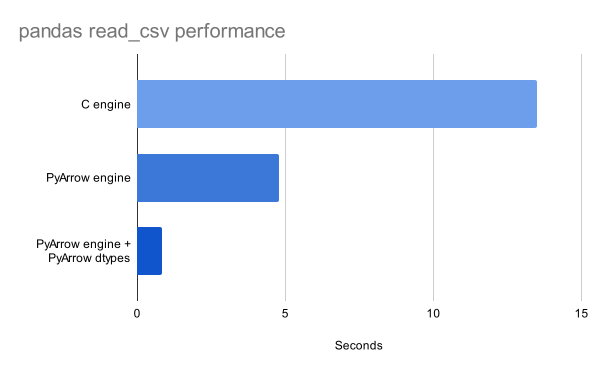
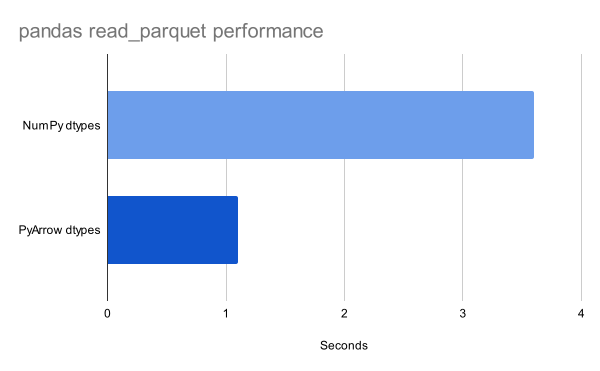

_Get the most out of PyArrow support in pandas and Dask right now_

## Introduction

Support for PyArrow dtypes in pandas, and by extension Dask, is still relatively fresh. I would 
still recommend caution when option into the PyArrow dtype_backend, since not every part of the 
API of both libraries is optimized yet. You should be able to get a big improvement with a bit of 
awareness though. I will go through a bunch of examples where switching to PyArrow is highly 
recommended. 

Dask itself can benefit in various ways from PyArrow dtypes. We will investigate how PyArrow backed
strings influence memory usage on Dask clusters and whether we can improve general and I/O 
performance through utilizing PyArrow.

I am part of the pandas core team and was heavily involved in implementing and improving PyArrow 
support in pandas. I've recently joined [Coiled](https://www.coiled.io) where I am working on Dask,
including improving the PyArrow integration in Dask.

## General overview of PyArrow support

The PyArrow dtypes were initially introduced in pandas 1.5. This means that support for them is
still relatively new. pandas 2.0 provided a huge improvement through making opting into them easy.
There is still some work left to support them properly everywhere. They should be used with caution
for a couple of months. We work continously to improve support throughout the Dask and pandas APIs.

We encourage users to try them out to get a better idea of what is still not efficient enough or
flat out not working. Giving feedback helps us improve support and will drastically reduce the
time that is necessary to find all issues.

## Dataset

We will use the taxi dataset from New York City that provides all Uber and Lyft rides, including
some interesting attributes like price, tips, driver pay and many more. The dataset can be found
[here](https://www.nyc.gov/site/tlc/about/tlc-trip-record-data.page) and is stored as parquet
files. When analyzing Dask queries, we will use a publicly available S3 bucket to simplify our
queries: ``s3://coiled-datasets/uber-lyft-tlc/``. We will use the datasets of the final quarter of 
2022 for our pandas queries, since this is the maximum that fits comfortably into memory on my 
machine (24GB of RAM). Stressing our RAM usage might introduce side effects when analyzing 
performance otherwise.

## Dask cluster

There is a multitude of different options to set up a Dask cluster, see the 
[Dask documentation](https://docs.dask.org/en/stable/deploying.html) for
a non-exhaustive list of deployment options. I will use 
[Coiled](https://docs.coiled.io/user_guide/index.html) to create a cluster on AWS with
30 machines through:

```python
import coiled

cluster = coiled.Cluster(
    n_workers=30,
    name="dask-performance-comparisons",
    region="us-east-2",  # this is the region of our dataset
)
```

Coiled is connected to my AWS account. It creates the cluster within my account and manages the
resources for me. 30 machines are enough to comfortably operate on our dataset. We will investigate
how we can reduce the required amount of workers to 15 instead of 30 through small modifications.

## pandas StringDtype with PyArrow backing

Let's start with a feature, that was originally introduced in pandas 1.0. 

Historically, pandas represented string data as NumPy object. NumPy object data are stored as an 
array of pointers that point to the actual data in memory. This makes iterating over an array of 
strings very slow, since the data are not contiguous in memory. pandas 1.0 intially introduced a
string dtype, that allowed easier operations on string. This dtype was still backed by Python 
strigs and thus, wasn't very performant either. Rather, it provided a clear abstraction of string
data.

pandas 1.3 finally introduced an efficient string dtype. It is backed by PyArrow strings.
PyArrow provides a data structure that enables performant and memory efficient string operations.
Starting from that point on, users could us a string dtype that was contiguous in memory and thus
very fast. This dtype can be requested by ``string[pyarrow]``. Alternatively, you can request it
by setting

````python
pd.options.mode.string_storage = "pyarrow"
````

and sepcifying ``string`` as the dtype. Since Dask builds on top of pandas, the string dtype
is available as well. On top of that, Dask offers a convenient option

```python
dask.config.set({"dataframe.convert-string": True})
```

that automatically converts all string-data to ``string[pyarrow]``. This is a convenient way of
avoiding strings in objects with NumPy object dtype. Additionally, it has the advantage that it
creates PyArrow array natively, if the I/O method provides Arrow objects directly. Memory usage is
a big topic for Dask users. Memory restrictions are harder to overcome in distributed environments.
On top of providing a huge performance improvements, PyArrow strings consume significantly less
memory. An average Dask DataFrame with PyArrow strings consumes around 33-50% of the original
memory with NumPy object. PyArrow strings are mature enough to provide a smooth user experience.

Let's look at a few operations that represent typical string operations. We will start with a couple
of pandas examples before switching over to operations on our Dask cluster.

We will use ``df.convert_dtypes`` to convert our object columns to PyArrow string arrays. There
are more efficient ways of getting PyArrow dtypes in pandas that we will explore later. We use
the Uber-Lyft dataset of October 2022, this file fits comfortably into memory on my machine.

```python
import pandas as pd

pd.options.mode.string_storage = "pyarrow"

df = pd.read_parquet(
    "fhvhv_tripdata_2022-10.parquet",
    columns=[
        "tips", 
        "hvfhs_license_num", 
        "driver_pay", 
        "base_passenger_fare", 
        "dispatching_base_num",
    ],
)
df = df.convert_dtypes(
    convert_boolean=False, 
    convert_floating=False, 
    convert_integer=False,
)
```

Our DataFrame has NumPy dtypes for all non-string columns in this example. Let's start with
filtering for all rides that were operated by Uber.

```python
df[df["hvfhs_license_num"] == "HV0003"]
```

This operation creates a mask with True/False values that specify whether Uber operated a ride. 
This doesn't utilize any special string methods, but the equality comparison dispatches to 
PyArrow. Next, we will use the String accessor that is implemented in pandas and gives you access
to all kinds of string operations on a per-element basis. We want to find all rides that were
dispatched from the base starting with ``"B028"``.

```python
df[df["dispatching_base_num"].str.startswith("B028")]
```

``startswith`` iterates over our array and checks whether every string starts with the specified
substring. The advantage of PyArrow is easy to see. The data are contiguous in memory, which means
that we can iterate very fast over them. Additionally, these arrays have a second array with 
pointers that point to the first memory address of every string.

Finally, we look at a ``GroupBy`` operation that groups over PyArrow string columns. The calculation
of the grouping columns can dispatch to PyArrow as well, which is more efficient than factorizing
over a NumPy object array.

```python
df.groupby(
    ["hvfhs_license_num", "dispatching_base_num"]
).mean(numeric_only=True)
```

Let's look at how these operations stack up against DataFrames with NumPy object arrays.

TODO: plot

The results are more or less as we expected. The string based comparisons are significantly faster
when performed on PyArrow strings. Most string accessors should provide a huge performance 
improvement. Another interesting observation is memory usage, it is reduced by roughly 50% compared
to NumPy object dtype.

Dask mirrors the pandas API and dispatches for most operations. Consequently, we can use
the same API to access PyArrow strings. A convenient option to request these globally is the option
mentioned above, which is what we will use here:

```python
dask.config.set({"dataframe.convert-string": True})
```

One of the biggest benefits of this option during development is that it enables easy testing of PyArrow
strings globally in Dask to make sure that everything works smoothly. We will utilize the Uber-Lyft
dataset for our explorations. The dataset takes up around 240GB of memory on our cluster. Our initial
cluster has 30 machines, which is enough to perform our computations comfortably.

```python
import dask
import dask.dataframe as dd

dask.config.set({"dataframe.convert-string": True})

df = dd.read_parquet(
    "s3://coiled-datasets/uber-lyft-tlc/",
    storage_options={"anon": True},
)
df = df.persist()
```

We persist the data in memory so that we don't skew our performance measurements. Our data is now
available in memory, which makes access fast. We will perform similar computations than we did
previously with pandas. One of the main goals is to show that the benefits from pandas will 
translate to computations in a distributed environment with Dask.

One of the first observations is that the DataFrame with PyArrow string columns consumes only
130GB of memory, only half of what it consumes with NumPy object columns. We have only a few string
columns in our DataFrame, which means that the memory savings are actually higher than around 50%
when switching to PyArrow strings. Consequently, we will reduce the size of our cluster to 15 workers
when performing our operations on PyArrow string columns.

We measure the performance of the mask-operation and one of the String accessors together through
subsequent filtering of the DataFrame. 

```python
df = df[df["hvfhs_license_num"] == "HV0003"]
df = df[df["dispatching_base_num"].str.startswith("B028")]
df = df.persist()
```

We see that we can use the same methods as in our previous example. This makes transitioning from
pandas to Dask relatively easy.

Additionally, we will again compute a GroupBy operation on our data. This is significantly harder
in a distributed environment, which makes the results more interesting. The previous operations
parallelize relatively easy onto a large cluster compared to a GroupBy operation.

```python
df = df.groupby(
    ["hvfhs_license_num", "dispatching_base_num"]
).mean(numeric_only=True)

df = df.persist()
```

TODO: plot

We get nice improvements by factors 2 and 3. This is especially intriguing since we reduced
the size of our cluster from 30 machines to 15. Subsequently, we also reduced our computational 
resources by a factor of 2, which makes our performance improvement even more impressive. We can
perform the same computations on a smaller cluster so save money and be more efficient in general
and still get a performance boost out of it.

Summarizing, we saw that PyArrow string-columns are a huge improvement to NumPy object columns in
DataFrames. Switching to PyArrow strings is a relatively small change that might improve the 
performance and efficiency of an average workflow that depends on string-data. These improvements 
are visible for pandas and Dask!

## engine keyword in I/O methods

We start by taking a look at I/O functions in pandas and Dask. Some functions have custom implementations, 
like ``read_csv``, while others dispatch to another library, like ``read_excel`` does to 
``openpyxl``. Some functions gained a new ``engine`` keyword that enables users to dispatch to 
``PyArrow``. The PyArrow parsers are multithreaded by default and hence, can provide a significant 
performance improvement.

```python
pd.read_csv("US_Accidents_Dec21_updated.csv", engine="pyarrow")
```

This configuration will return the same results as the other engines, the only difference is that
PyArrow is used to read the data.
The same option is available for ``read_json``.
The engines were added to provide users a faster way of reading data. The improved speed is only
one of the advantages. The Arrow readers return the data as a 
[PyArrow Table](https://arrow.apache.org/docs/python/generated/pyarrow.Table.html). A PyArrow Table
provides built-in functionality to convert to a pandas ``DataFrame``. Depending on the data, this
might require a copy while casting to NumPy (string, integers with missing values, ...), which
brings an unnecessary slowdown. This is where the PyArrow ``dtype_backend``, built into pandas, comes in.
It is implemented as an ``ArrowExtensionArray`` class in pandas, which is backed by a 
[PyArrow ChunkedArray](https://arrow.apache.org/docs/python/generated/pyarrow.ChunkedArray.html).
As a direct consequence, the conversion from a PyArrow Table to pandas is extremely cheap, since it
does not require any copies. 

```python
pd.read_csv("US_Accidents_Dec21_updated.csv", engine="pyarrow", dtype_backend="pyarrow")
```

This returns a ``DataFrame`` that is backed by PyArrow arrays. pandas isn't optimized everywhere
yet, so this can provide a slowdown in follow-up operations. It might be a worthwile tradeoff, if
the workload is particularly I/O heavy. Let's look at a direct comparison:



We can see that PyArrow-engine and PyArrow dtypes provide a 10x speedup compared
to the C-engine.

The same advantages apply to Dask. Dask wraps the pandas csv reader and
hence, gets the same features for free.

The comparison is a bit more complicated
here though. Firstly, my example reads the data from my local machine while
our Dask examples will read the data from a S3 bucket. Network speed will
be a relevant component here. Also, distributed computations have some
overhead that we have to account for. 

We are purely looking for speed here, so we will read some timeseries data
from a S3 bucket. 

```python
import dask.dataframe as dd
from distributed import wait

df = dd.read_csv(
    "s3://coiled-datasets/timeseries/20-years/csv/0001.part",
    storage_options={"anon": True},
    engine="pyarrow",
    parse_dates=["timestamp"],
)
df = df.persist()  # trigger the actual computation
wait(df)  # Wait till the computation is finished to measure performance
```

We will execute this code-snippet for ``engine="c"``, ``engine="pyarrow"`` and additionally
``engine="pyarrow"`` with ``"dtype_backend="pyarrow"``. Let's look at some performance comparisons.
Both examples were executed with 30 machines on the cluster. We want to be explicit when inferring
dtypes in this case, our column ``timestamp`` is a ``datetime`` column, which is why we specify
this explicitly.


The PyArrow-engine runs around 2 times faster than the C-engine. Both implementations used the same
number of machines. The memory usage was reduced by 50% with the PyArrow ``dtype_backend``. The same
reduction is available if only object columns are converted to PyArrow strings as well, which gives
a better experience in other methods.

We've seen that the Arrow-engines provide significant speedups over the custom C implementations.
They don't support all features of the custom implementations yet, but if your use-case is 
compatible with the supported options, you should get a significant speedup more or less for free.

The case with the PyArrow ``dtype_backend`` is a bit more complicated. Not all areas of the API are
optimized yet. If you spend a lot of time processing your data outside I/O functions, then this might not 
give you what you need. It will speed up your processing though, if your workflow is I/O heavy,
e.g. if most of your time is spent reading the data.

## dtype_backend in PyArrow native I/O readers

Some other I/O methods have an engine keyword as well. ``read_parquet`` is the most popular 
example. The situation is a bit different here though. These I/O methods were already using the
PyArrow engine by default. So the parsing is already as efficient as possible. One other potential
performance benefit is the usage of the ``dtype_backend``. Setting it to ``"pyarrow"`` avoids 
the conversion to NumPy dtypes after finishing the reading. This gives a decent performance 
improvement and saves a lot of memory.

Let's look at one pandas performance comparison. We read the Uber-Lyft taxi data from October 2022.

```python
pd.read_parquet("fhvhv_tripdata_2022-10.parquet")
```

We read the data without an explicit dtype backend and also with ``dtype_backend="pyarrow"``.



We can easily see that the most time is taken up by the conversion after actually reading the
file and not by reading the parquet file in PyArrow. The function runs 3 times as fast when avoiding
the conversion to NumPy dtypes.

Dask has a specialised implementation for ``read_parquet`` that has some advantages tailored to
distributed workloads compared to the pandas implementation. The common denominator is that both
functions dispatch to PyArrow to read the parquet file. Both have in common that the data are
converted to NumPy dtypes after finishing the reading process. We are reading
the whole Uber-Lyft dataset, which consumes around 240GB of memory on our
cluster.

```python
import dask.dataframe as dd
from distributed import wait

df = dd.read_parquet(
    "s3://coiled-datasets/uber-lyft-tlc/",
    storage_options={"anon": True},
)
df = df.persist()
wait(df)
```

We read the dataset in 3 different configurations. First with the default NumPy dtypes, then with
the PyArrow string options turned on,

```python
dask.config.set({"dataframe.convert-string": True})
```

and lastly with ``dtype_backend="pyarrow"``. Let's look at what this means performance-wise:


Similar to our pandas example, we can see that converting to NumPy dtypes takes up a huge chunk of
our runtime. The PyArrow dtypes give us a nice performance improvement. Memory usage is half of what
NumPy dtypes consume. Both PyArrow configurations consume roughly the same amount of memory. 

PyArrow-strings are a lot more mature than the general PyArrow dtype backend. Based on the performance
chart we got, we get roughly the same performance improvement when using PyArrow strings and NumPy dtypes
for all other dtypes. If a workflow does not work well enough on PyArrow dtypes yet, it makes a lot
of sense to enable PyArrow strings only.

## Conclusion

We have seen how we can leverage PyArrow in pandas in Dask right now. PyArrow strings have the
potential to impact most workflows in a positive way and provide a smooth user experience with
pandas 2.0. Dask has a convenient option to globally avoid NumPy object dtype when possible, which
makes opting into PyArrow backed strings even easier. PyArrow also provides huge speedups in other
areas where available. The PyArrow ``dtype_backend`` is still pretty new and has the 
potential to cut I/O times significantly. It is certainly worth exploring whether it can solve
performance bottlenecks. It will speed up the average workflow that is not I/O heavy in the future.
There is a lof of exiting work going on.

There is a current proposal in pandas to start inferring strings as PyArrow backed strings by
default starting from pandas 3.0. Additionally, it includes many more areas where leaning more
onto PyArrow makes a lot of sense (e.g. Decimals, structured data, ...). You can read up the
proposal here (TODO link).
