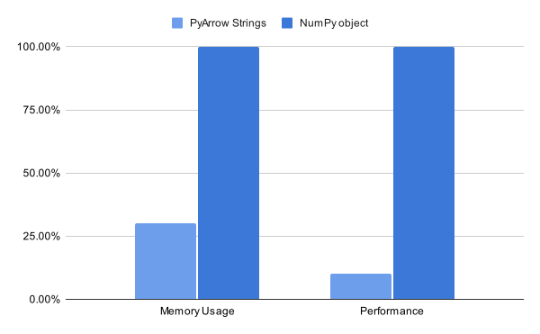

_How the API is changing and how to leverage new functionalities_



## Introduction

After 3 years of development, the second pandas 2.0 release candidate was released on the 16th of 
March. There are many new features in pandas 2.0, including improved extension array
support, pyarrow support for DataFrames and non-nanosecond datetime resolution, but also
many enforced deprecations and hence API changes. Before we investigate how new features can improve
your workflow, we take a look at some enforced deprecations.

## API changes

The 2.0 release is a major release for pandas (check out the 
[versioning policy](https://pandas.pydata.org/docs/development/policies.html#version-policy)), 
hence all deprecations added in the 1.x series were enforced.
There were around 150 different warnings in the latest 1.5.3 release. If your code runs without
warnings on 1.5.3, you should be good to go on 2.0. We will have a quick look at some
subtle or more noticeable deprecations before jumping into new features. You can check out the
complete release notes [here](https://pandas.pydata.org/docs/dev/whatsnew/v2.0.0.html).

### Index now supports arbitrary NumPy dtypes

Before the 2.0 release, an ``Index`` only supported ``int64``, ``float64`` and ``uint64`` dtypes 
which resulted in an ``Int64Index``, ``Float64Index`` or ``UInt64Index``. These classes where 
removed. All numeric indexes are now represented as ``Index`` with an associated dtype, e.g.:

````python
In [1]: pd.Index([1, 2, 3], dtype="int64")
Out[1]: Index([1, 2, 3], dtype='int64')
In [2]: pd.Index([1, 2, 3], dtype="int32")
Out[2]: Index([1, 2, 3], dtype='int32')
````

This mirrors the behavior for extension array backed Indexes. An Index can hold arbitrary extension 
array dtypes since pandas 1.4.0. You can check the 
[release notes](https://pandas.pydata.org/docs/dev/whatsnew/v2.0.0.html#index-can-now-hold-numpy-numeric-dtypes) 
for further information. This change is only noticeable when an explicit Index subclass, that no
longer exists, is used.

### Behavior change in ``numeric_only`` for aggregation functions

In previous versions you could call aggregation functions on a DataFrame with mixed-dtypes and
got varying results. Sometimes the aggregation worked and excluded non-numeric dtypes, in some
other cases an error was raised. The ``numeric_only`` argument is now consistent and the aggregation
will raise if you apply it on a DataFrame with non-numeric dtypes. You can set ``numeric_only``
to ``True`` or restrict your DataFrame to numeric columns, if you want to get the same behavior
as before. This will avoid accidentally dropping relevant columns from the ``DataFrame``.

Calculating the mean over a DataFrame dropped non-numeric columns before 2.0:

```python
In[2] df = DataFrame({"a": [1, 2, 3], "b": ["x", "y", "z"]})
In[3] df.mean()
Out[3]: 
a    2.0
dtype: float64
```

This operation now raises an error to avoid dropping relevant columns in these aggregations:

```python
TypeError: Could not convert ['xyz'] to numeric
```

## Improvements and new features

pandas 2.0 brings a some interesting new functionalities like PyArrow-backed DataFrames, 
non-nanosecond resolution/accuracy for timestamps and many Copy-on-Write improvements. Let's take
a closer look at some of those now.

### Improved support for nullable dtypes and extension arrays

The 2.0 release brings a vast improvement for nullable dtypes and extension arrays in general.
Internally, many operations now use nullable semantics instead of casting to object when
using nullable dtypes like ``Int64``, ``boolean`` or ``Float64``. The internal handling of extension
arrays got consistently better over the 1.x series. This is visible through
a bunch of significant performance improvements:

On pandas 2.0:

```python
In[3]: ser = pd.Series(list(range(1, 1_000_000)) + [pd.NA], dtype="Int64")
In[4]: %timeit ser.drop_duplicates()
7.54 ms ± 24 µs per loop (mean ± std. dev. of 7 runs, 100 loops each)
```

On pandas 1.5.3:

```python
In[3]: ser = pd.Series(list(range(1, 1_000_000)) + [pd.NA], dtype="Int64")
In[4]: %timeit ser.drop_duplicates()
22.7 ms ± 272 µs per loop (mean ± std. dev. of 7 runs, 10 loops each)
```

Additionally, many operations now properly operate on the nullable arrays which maintains the
appropriate dtype when returning the result. All groupby algorithms now use nullable semantics,
which results in better accuracy (previously the input was cast to float which might have let
to a loss of precision) and performance improvements.

To improve opting into nullable dtypes, a new keyword ``dtype_backen`` which returns
a ``DataFrame`` completely backed by nullable dtypes when set to ``"numpy_nullable"`` was added to 
most I/O functions. In addition to using nullable dtypes for numeric columns, 
this option results in a ``DataFrame`` that uses the pandas ``StringDtype``
instead of a NumPy array with dtype ``object``. Based on the storage option, the string columns
are either backed by Python strings or by PyArrow strings. The PyArrow alternative is generally
faster than the Python strings.

The ``Index`` and ``MultiIndex`` classes are now better integrated with extension
arrays in general. General Extension Array support was introduced in 1.4. A quick overview of what
this entails:

- Using extension array semantics for operations on the index
- Efficient Indexing operations on nullable and pyarrow dtypes
- No materialization of MultiIndexes to improve performance and maintain dtypes

The Extension Array interface is continuously improving and continues to avoid materializing NumPy 
arrays and instead relies on the provided extension array implementation in a growing number
of methods. Some areas are still under development, including GroupBy aggregations for third party 
extension arrays.

### Pyarrow-backed DataFrames

Version 1.5.0 brought a new extension array to pandas that enables users to create ``DataFrames``
backed by PyArrow arrays. We expect these extension arrays to provide a vast improvement when
operating on string-columns, since the NumPy object representation is not very efficient. The
string representation is mostly equivalent to``string[pyarrow]`` that has been around for quite some 
time. The PyArrow-specific extension array supports all other PyArrow dtypes on top of it. Users can 
now create columns with any PyArrow dtype and/or use PyArrow nullable semantics. Those
come out of the box when using PyArrow dtypes. A PyArrow-backed column can be requested 
specifically by casting to or specifying a column's dtype as ``f"{dtype}[pyarrow]"``, e.g. 
``"int64[pyarrow]"`` for an integer column. Alternatively, a PyArrow dtype can be created through:

```python
import pandas as pd
import pyarrow as pa

dtype = pd.ArrowDtype(pa.int64)
```

The API in 1.5.0 was pretty raw and experimental and fell back to NumPy quite often. With pandas 2.0 and an 
increased minimum version of PyArrow (7.0 for pandas 2.0), we can now utilize the corresponding PyArrow compute 
functions in many more methods. This improves performance significantly and gets rid of many
``PerformanceWarnings`` that were raised before when falling back to NumPy. Similarly to the
nullable dtypes, most I/O methods can return PyArrow-backed DataFrames through the keyword
``dtype_backend="pyarrow"``

Future versions of pandas will bring many more improvements in this area!

Some I/O methods have specific PyArrow engines, like ``read_csv`` and ``read_json``, which bring
a significant performance improvement when requesting PyArrow-backed ``DataFrames``. They don't 
support all options that the original implementations support yet. Check out a more [in-depth
exploration](https://datapythonista.me/blog/pandas-20-and-the-arrow-revolution-part-i) from Marc 
Garcia.

### Non-nanosecond resolution in Timestamps

A long-standing issue in pandas was that timestamps were always represented in nanosecond 
resolution. As a consequence, there was no way of representing dates before the 1st of January
1970 or after the 11th of April 2264. This caused pains in the research community when analyzing
timeseries data that spanned over millennia and more.

The 2.0 release introduces support for other resolutions, e.g. support for second, millisecond
and microsecond resolution was added. This enables time ranges up to ``+/- 2.9e11 years`` and thus 
should cover most common use-cases.

On previous versions, passing a date to the ``Timestamp`` constructor that was out of the supported
range raised an error no matter what unit was specified. With pandas 2.0 the unit is honored, and
thus you can create arbitrary dates:

```python
In[5]: pd.Timestamp("1000-10-11", unit="s")
Out[5]: Timestamp('1000-10-11 00:00:00')
```

The timestamp is only returned up to the second, higher precisions are not supported when specifying
``unit="s"``.

Support for non-nanosecond resolutions of timestamps is still actively developed. Many
methods relied on the assumption that a timestamp was always given in nanosecond resolution. It is
a lot of work to get rid of these problems everywhere and hence you might still encounter some
bugs in different areas.

### Copy-on-Write improvements

Copy-on-Write (CoW) was originally introduced in pandas 1.5.0. Check out my initial post introducing
[Copy-on-Write](https://phofl.github.io/cow-introduction.html).

> __Short summary:__
> 
> __Any DataFrame or Series derived from another in__ 
> __any way always behaves as a copy__. As a consequence, we can only change the values of an object 
> through modifying the object itself. CoW disallows updating a DataFrame or a Series that shares 
> data with another DataFrame or Series object inplace.

Version 1.5 provided the general mechanism but not much apart from that. A couple of bugs where 
Copy-on-Write was not respected, and hence two objects could get modified with one operation, were
discovered and fixed since then.

More importantly, nearly all methods now utilize a _lazy copy_ mechanism to avoid copying the
underlying data as long as possible. Without CoW enabled, most methods perform defensive copies 
to avoid side effects when an object is modified later on. This results in high memory usage and a
relatively high runtime. Copy-on-Write enables us to remove all defensive copies and defer
the actual copies until the data of an object are modified.

Additionally, CoW provides a cleaner and easier to work with API and should give your code a
performance boost on top of it. Generally, if an application does not rely on updating more than one object at
once and does not utilize chained assignment, the risk of turning Copy-on-Write 
on is minor. I've tested it on some code-bases and saw promising performance improvements, so I'd recommend
trying it out to see how it impacts your code. We are currently planning on making CoW the default in the next
major release. I'd recommend developing new features with Copy-on-Write enabled
to avoid migration issues later on.

A PDEP (pandas development enhancement proposal) was submitted to deprecate and remove the
``inplace`` and ``copy`` keyword in most methods. Those would become obsolete with Copy-on-Write
enabled and would only add confusion for users. You can follow this discussion 
[here](https://github.com/pandas-dev/pandas/pull/51466). If accepted, the removal of both keywords
will happen when CoW is made the default.

## Conclusion

pandas 2.0 brings many new and exiting features. We've seen a couple of them and looked at how
to utilize them. 

Thank you for reading. Feel free to reach out in the comments to share your thoughts and feedback 
on the 2.0 release. I will write additional posts focusing on Copy-on-Write and how to get the
most out of it. Follow me on Medium if you like to read more about pandas in general.
